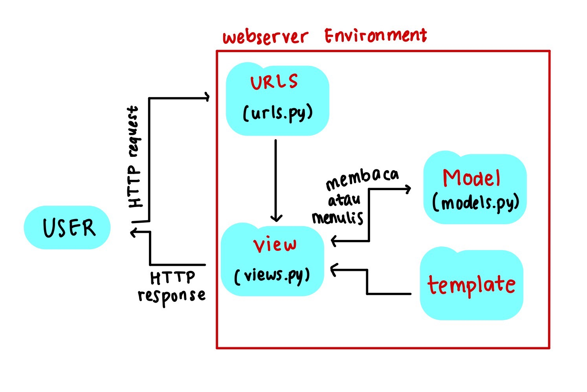
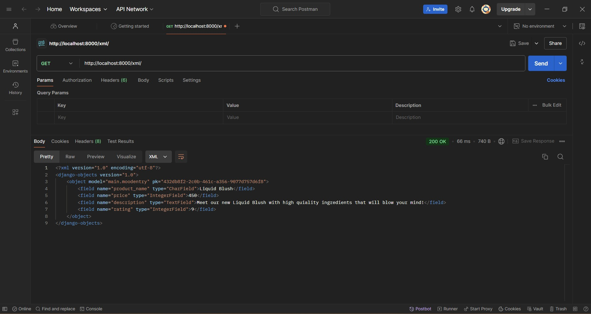
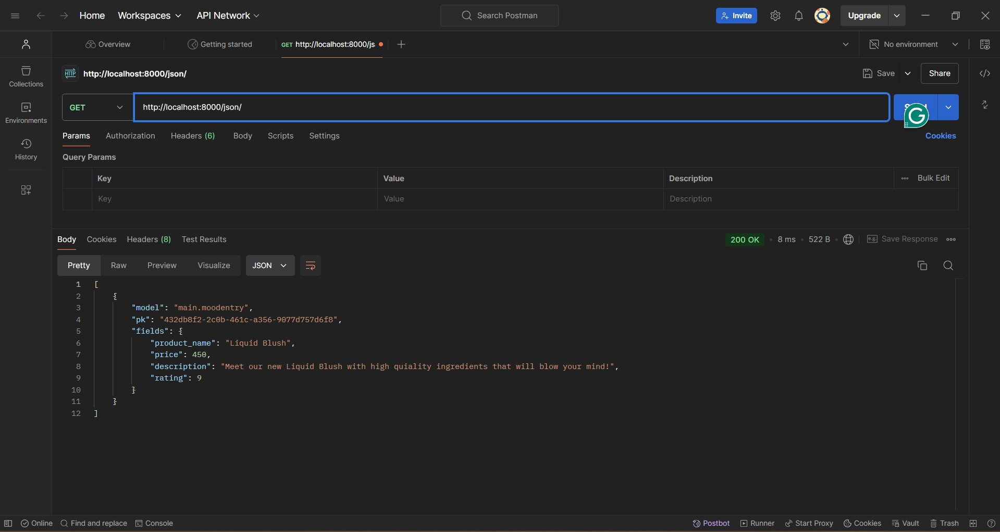
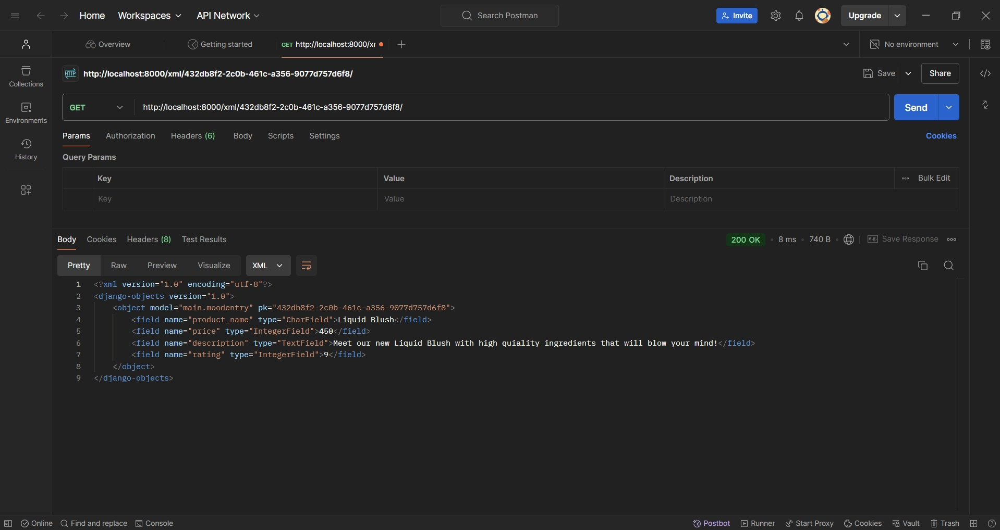
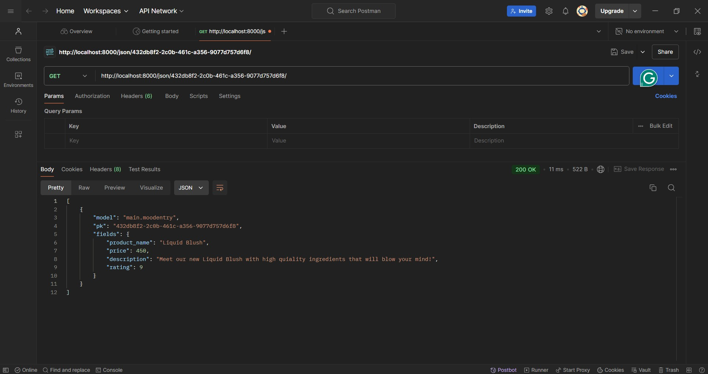

**Nama : Shalya Naura Lionita**
**NPM : 2306245535**
**Kelas : B**
>**Shapping :** http://shalya-naura-shapping.pbp.cs.ui.ac.id/

## **Penjelasan Tugas**
<details>
<summary> <b> Tugas 2 : Implementasi Model-View-Template (MVT) pada Django <b> </summary>  


## **Implementasi Checklist Tugas**
* ### Membuat proyek Django baru:
1. Pertama saya membuat direktori baru dengan nama 'shapping' kemudian mengaktifkan virtual environmentnya.
2. Membuat berkas baru dengan nama requirement.txt untuk menyimpan dependencies yang diperlukan, yaitu :
```
django
gunicorn
whitenoise
psycopg2-binary
requests
urllib3
```

3. Melakukan instalasi terhadap dependenciesnya dengan menjalankan perintah 'pip install -r requirements.txt'
4. Terakhir membuat proyek Django bernama 'shapping' dengan menjalankan perintah 'django-admin startproject mental_health_tracker .'  


* ### Membuat aplikasi dengan nama main pada proyek Shapping:
1. Membuka terminal di dalam direktori Shapping kemudian menjalankan perintah 'python manage.py startapp main' agar membuat direktori baru bernama main di dalam direktori utama Shappiing.
2. Setelah terbentuk direktori baru bernama main, direktori main tersebut akan berisi struktur awal untuk membuat aplikasi.
3. Mmebuka berkas settings.py di dalam direktori proyek Shapping (bukan direktori utama) kemudian menambahkan 'main' di dalam daftar aplikasi yang dapat diakses pada variabel INSTALLED_APPS.
4. aplikasi main berhasil dibuat dan didaftarkan.  


* ### Membuat routing pada proyek agar dapat menjalankan aplikasi main:
1. Membuat berkas urls.py di dalam direktori main yang telah saya buat tadi
2. Mengisi urls.py dengan kode berikut :

```
from django.urls import path
from main.views import show_main

app_name = 'main'

urlpatterns = [
    path('', show_main, name='show_main'),
]
```

3. Membuka berkas urls.py yang ada di dalam direktori proyek shapping lalu menambahkan fungsi include dan rute Url di dalam variabel urlpatterns seperti berikut :

```
from django.contrib import admin
from django.urls import path, include

urlpatterns = [
    path('admin/', admin.site.urls),
    path('', include('main.urls')),
]
```

4. Menjalankan proyek Django dengan perintah 'python manage.py runserver'.  


* ### Membuat model pada aplikasi main dengan nama Product yang memiliki atribut wajib name, price, dan description :
1. Membuka berkas models.py yang sudah ada pada direktori aplikasi main kemudian diisi dengan kode berikut:

```
from django.db import models

class MoodEntry(models.Model):
    mood = models.CharField(max_length=255)
    time = models.DateField(auto_now_add=True)
    feelings = models.TextField()
    mood_intensity = models.IntegerField()

    @property
    def is_mood_strong(self):
        return self.mood_intensity > 5
```

2. Menjalankan perintah 'python manage.py makemigrations' untuk membuat migrasi model dan perintah 'python manage.py migrate' untuk menerapkan migrasi ke dalam basis data lokal.  


* ### Membuat sebuah fungsi pada views.py :
1. Membuka berkasi views.py yang terletak di dalam berkas aplikasi main kemudia menambahkan fungsi show_main di bawah impor yang sudah ada seperti berikut :

```
def show_main(request):
context = {
    'name' : 'Liquid Blush',
    'price': 'Rp350.000,00',
    'description': 'Meet our new Liquid Blush with high quiality ingredients that will blow your mind!',
    'rating' : '4.7/5.0',
}

return render(request, "main.html", context)  
```  


* ### Membuat sebuah routing pada urls.py aplikasi main untuk memetakan fungsi yang telah dibuat pada views.py :
1. Membuat berkas urls.py di dalam direktori main yang telah saya buat tadi
2. Mengisi urls.py dengan kode berikut :

```
from django.urls import path
from main.views import show_main

app_name = 'main'

urlpatterns = [
    path('', show_main, name='show_main'),
]
```

3. Membuka berkas urls.py yang ada di dalam direktori proyek shapping lalu menambahkan fungsi include dan rute Url di dalam variabel 
```
urlpatterns seperti berikut :

    from django.contrib import admin
    from django.urls import path, include

    urlpatterns = [
        path('admin/', admin.site.urls),
        path('', include('main.urls')),
    ]
```

4. Menjalankan proyek Django dengan perintah 'python manage.py runserver'.  


* ### Melakukan deployment ke PWS terhadap aplikasi yang sudah dibuat :
1. Mengakses halaman pws (https://pbp.cs.ui.ac.id) kemudian login dengan data diri saya
2. DI home page PWS, saya membuat proyek baru dengan 'Create New Project' lalu membuat project name sebagai shapping.
3. Kembali ke VS Code, pada berkas settings.py di dalam direktori proyek shapping saya mengubah ALLOWED_HOSTS menjadi:

```
    ALLOWED_HOSTS = ["localhost", "127.0.0.1", "shalya-naura-shapping.pbp.cs.ui.ac.id"]
```

4. Melakukan perintah git add, commit, dan push untuk menyimpan perubahan ke repositori GitHub yang telah saya buat sebelumnya.
5. Menjalankan perintah yang ada di informasi Project Command setelah saya membuat project baru di PWS di dalam terminal direktori utama shapping saya.
6. Saat melakukan perintah push ke dalam PWS saya, saya memasukkan username dan password yang saya terima saat saya membuat project di PWS.
7. Menjalankan perintah 'git branch -M main' untuk merubah branch utama saya menjadi main
8. Terakhir saya menunggu di site bar situs PWS saya hingga project saya menjadi success.

* ### Membuat sebuah README.md :
1. Membuat berkas baru README.md
2. Masukkan link aplikasi PWS saya yang sudah di-deploy
3. Menjawab pertanyaan yang disediakan  


## **Bagan Request Client ke web aplikasi berbasis Django**

Pada aplikasi berbasis Django, alur dimulai ketika client mengirimkan request HTTP ke server. Request ini diterima oleh urls.py, yang bertugas memetakan URL ke fungsi tertentu di views.py. Di views.py, logika aplikasi diproses, dan jika diperlukan data dari database, views.py akan berinteraksi dengan models.py untuk mengambil atau memanipulasi data. Setelah data diperoleh, views.py mengirimkan data tersebut ke template (mengubah HTTP ke bentuk halaman HTML) yang akan di-render menjadi halaman web. views.py kemudian akan mengambil data yang diperlukan models.py lalu menampilkannya menggunakan template.  


## **Menjelaskan Fungsi git dalam pengembangan perangkat lunak**
Git adalah alat versi kontrol yang digunakan dalam pengembangan perangkat lunak untuk:
1. Melacak Perubahan Kode: Mencatat setiap perubahan yang dilakukan pada kode, memungkinkan pengembang untuk melihat riwayat perubahan.
2. Kolaborasi Tim: Memungkinkan beberapa pengembang bekerja pada proyek yang sama tanpa konflik melalui fitur branching.
3. Branching dan Merging: Pengembang dapat membuat branch untuk fitur baru atau perbaikan, lalu menggabungkannya ke kode utama setelah diuji.
4. Pemulihan Versi: Memungkinkan rollback ke versi kode sebelumnya jika terjadi kesalahan.
5, Review Kode: Kode dapat direview melalui pull request sebelum digabungkan ke branch utama.  


## **Mengapa framework Django dijadikaan pemulaan pembelajaran pengembangan perangkat lunak?**
Django dipilih untuk pemula karena:
1. Struktur MVT yang jelas memudahkan pemahaman.
2. Fitur bawaan lengkap (otentikasi, keamanan, manajemen database) mempercepat pengembangan.
3. ORM sederhana mempermudah interaksi dengan database tanpa perlu SQL.
4. Keamanan bawaan melindungi dari ancaman umum seperti CSRF dan SQL injection.
5. Dokumentasi lengkap dan komunitas besar mendukung pembelajaran.

Django memungkinkan pemula memahami konsep dasar pengembangan web dengan cepat dan efektif.  


## **Mengapa model pada Django disebut sebagai ORM?**  
Model pada Django disebut sebagai ORM (Object-Relational Mapping) karena model ini menghubungkan antara objek Python dan tabel dalam database. Dengan ORM, pengembang dapat berinteraksi dengan database menggunakan objek Python alih-alih menulis query SQL langsung.

ORM secara otomatis menerjemahkan operasi seperti Create, Read, Update, Delete (CRUD) ke dalam perintah SQL yang dieksekusi di database, sehingga pengembang hanya perlu bekerja dengan objek Python untuk mengelola data. Ini membuat pengelolaan database lebih sederhana dan lebih aman.  

</details>

<details>
<summary> <b> Tugas 3 : Implementasi Form dan Data Delivery pada Django <b> </summary>

## **Mengapa kita memerlukan data delivery dalam pengimplementasian sebuah platform?**
Data delivery diperlukan dalam pengimplementasian sebuha platform karena platform modern sering kali mengandalkan transfer data yang efisien, aman, dan tepat waktu untuk menyediakan layanan kepada pengguna. Beberapa alasan mengapa data delivery sengatlah penting :
1. Ketersediaan dan Kecepatan Akses Informasi : Data delivery memastikan pengguna dapat mengakses informasi yang mereka butuhkan dengan cepat dan tepat.
2. Sinkronisasi Data antar Komponen : Data delivery membantu menyinkronkan data di antara komponen-komponen tersebut sehingga sistem bekerja secara konsisten dan terkoordinasi.
3. User Experience yang Lebih Baik : Pengiriman data yang cepat dan handal memastikan pengguna tidak mengalami lag atau kesalahan saat mengakses platform.

Masih ada banyak lagi alasan mengapa memerlukan data delivery dalam pengimplementasian sebuah platform seperti real-time data processing, keamanan dan privasi data, Optimasi kinerja sistem, dan lain sebagainya. Maka dari itu, data delivery menjadi hal yang sangat penting dalam pengoperasian platform modern. Dengan pengiriman data yang tepat dan efisien, platform dapat memberikan layanan yang lebih cepat, lebih aman, dan lebih dapat diandalkan, yang pada akhirnya menignkatkan pengalaman pengguna dan efisiensi operasional.  


## **Menurutmu, mana yang lebih baik antara XML dan JSON? Mengapa JSON lebih populer dibandingkan XML?**
Menurut saya, JSON lebih baik jika dibandingkan dengan XML. Secara umum, JSON memang lebih disukai dan populer dibandingkan XML, terutama dalam pengembangan aplikasi web modern. Ada beberapa alasan yang dapat mendukung pernyataan saya mengenai popularitas JSON dibandingkan dengan XML :
1. Format yang Lebih Ringkas dan Mudah Dibaca : JSON memiliki format yang lebih sederhana, ringkas, dan mudah dibaca karena JSON menggunakan tanda kurung kurawal "{}" untuk objek dan tanda kurung siku "[]" untuk array. XML, di sisi lain, menggunakan tag pembuka dan penutup "(<tag>...</tag>)", yang cenderung membuat file panjang dan sulit dibaca.
2. Kinerja yang Lebih Baik : Karena JSON lebih ringan dan ringkas dibandingkan XML, pengiriman data JSON melalui jaringan memerlukan lebih sedikit bandwith dan labih cepat.
3. Lebih Mudah Diprodes oleh Banyak Bahasa Pemrograman : JSON lebih mudah diproses oleh banyak bahasa pemrograman modern, seperti Python, Ruby, JavaScript, dan PHP memiliki dukungan asli untuk bekerja dengan JSON.

Berdasarkan alasan-alasan tersebut, menurut saya, JSON lebih baik dalam hal kinerja, kemudahan integrasi, dan kesederhanaan, sehingga lebih cocok untuk aplikasi web dan mobile modern. Meskipun terkadang XML masih perlu digunakan untuk hal-hal tertentu, JSON tetap lebih populer dan nyaman digunakan karena kesederhanaan, efisiensi, dan kemampuannya untuk bekerja lebih baik dengan bahasa pemrograman modern dan arsitektur web.  

  

## **Jelaskan fungsi dari method is_valid() pada form Django dan mengapa kita membutuhkan method tersebut?**
Method is_valid() pada form Django memiliki fungsi untuk memvalidasi data yang dikirimkan ke form, baik dari request (biasanya POST) maupun dari sumber lainnya. Method ini sangat penting karena memastikan bahwa data yang di-input oleh pengguna sudah sesuai dengan aturan dan batasan yang ditentukan pada form sebelum data tersebut digunakan atau disimpan ke database. Berikut ini beberapa fungsi "is_valid()" dalam Django :
1. Memeriksa Validasi Data : Method "is_valid()" akan memeriksa apakah data yang dikirimkan melalui form sesuai dengan semua aturan validasi yang didefinisikan di dalam form.
2. Mengisi Atribut "cleaned_data" : Jika form valid, method "is_valid()" akan mengisi atribut "cleaned_data," yang berisi data yang telah divalidasi dan difromat ulang sesuai dengan aturan yang telah ditetapkan.
3. Mengumpulkan Error Jika Tidak Valid : Jika data form tidak valid, method "is_valid()" akan mengisi atribut "errors," yang berisi detail kesalahan validasi yang terjadi.  


Berikut beberapa alasan mengapa kita membutuhkan "is_valid()" :
1. Mencegah Data yang Tidak Valid Untuk Masuk ke Database : Tanpa validasi, data yang tidak sesuai atau salah dapat masuk ke dalam databse, yang bisa menyebablan masalah seperti korupsi data, error aplikasi, atau hasil yang tidak diinginkan.
2. Keamanan Aplikasi : Dengan menggunakan validasi form, kita dapat melindungi aplikasi dari input yang berbahaya, seperti serangan, karena data yang tidak sesuai tidak akan diproses atau dimasukkan ke dalam sistem.
3. Memberikan Feedback kepada Pengguna : "is_valid()" membantu memberikan umpan balik langsung kepada pengguna jika mereka mengisi form dengan data yang tidak valid.  

Method "is_valid()" adalah komponen penting dalam sistem form Django yang membantu memastikan bahwa data yang dikirim oleh pengguna sesuai dengan aturan yang ditenntukan. Ini membantu melindungi aplikasi dari kesalahan input, menjaga integritas data, meningkatkan keamanan, dan memberikan umpan balik yang baik kepada pengguna.
  

## **csrf_token pada Django
CSRF token (Cross-Site Request Forgery token) adalah bagian penting dari keamanan dalam aplikasi Django, terutama saat menangani form yang mengirimkan data melalui metode POST. Ini adalah mekanisme yang melindungi aplikasi dari serangan CSRF, yang merupakan salah satu jenis serangan keamanan pada aplikasi web.  
  

* ### Mengapa Kita Membutuhkan "csrf_token" dalam Form Django?
1. Melindungi dari Serangan CSRF : Serangan CSRF terjadi ketika penyerang mencoba memanfaatkan sesi aktif pengguna untuk mengirimkan permintaan palsu ke server tanpa sepengetahuan pengguna. Jika aplikasi tidak dilindungi oleh CSRF token, penyerang dapat memalsukan permintaan atas nama pengguna yang sudah login dan memiliki sesi aktif.
2. Meningkatkan Keamanan Aplikasi : CSRF token memastikan bahwa setiap permintaan POST yang dikirimkan dari form web diverifikasi terlebih dahulu. Server memeriksa token pada setiap permintaan POST untuk memastikan bahwa itu berasal dari halaman atau situs yang sah, bukan dari sumber eksternal atau skrip jahat. Tanpa csrf_token, permintaan berbahaya bisa diterima dan diproses oleh server, yang bisa menimbulkan risiko keamanan serius.  

* ### Apa yang Terjaid Jika Tidak Menambahkan "csrf_token" pada Form?
1. Serangan CSEF dapat terjadi : Penyerang dapat mengeksploitasi sesi login aktif pengguna di aplikasi web. Dengan cara membuat halaman web yang berbahaya, penyerang bisa memaksa browser pengguna untuk melakukan permintaan POST ke server aplikasi tanpa disadari oleh pengguna.
2. Form Tidak Akan Diproses oleh Django : Secara default, Django akan menolak setiap permintaan POST tanpa CSRF token, dan menghasilkan kesalahan 403 Forbidden. Django memiliki mekanisme perlindungan otomatis yang akan memeriksa apakah setiap form POST mengandung token. Jika token tidak ada atau tidak valid, permintaan akan diblokir.  
  

* ### Bagaimana Penyerang Bisa Memanfaatkan Ketiadaan "csrf_token"?
Jika aplikasi web tidak menggunakan csrf_token, penyerang bisa melakukan serangan CSRF dengan langkah-langkah berikut :
1. Mengelabui Pengguna untuk Mengirim Permintaan Berbahaya : Penyerang dapat membuat situs web palsu atau menyisipkan link berbahaya di email, media sosial, atau pesan lainnya. Ketika pengguna yang login ke aplikasi membuka situs palsu atau mengklik link tersebut, situs tersebut akan mengirimkan permintaan POST ke server aplikasi menggunakan sesi pengguna yang sah.
2. Manipulasi Form di Latar Belakang : Dengan ketiadaan "csrf_token", penyerang dapat menyisipkan permintaan POST di latar belakang (melalui skrip tersembunyi) yang dikirim dari situs eksternal ke server aplikasi. Permintaan ini menggunakan sesi autentikasi pengguna yang aktif tanpa mereka sadari.  

"csrf_token" adalah komponen penting dalam keamanan form di Django yang melindungi aplikasi dari serangan Cross-Site Request Forgery (CSRF). Tanpa CSRF token, penyerang bisa memanfaatkan sesi pengguna yang sah untuk melakukan aksi tanpa izin, seperti mengubah data atau melakukan transaksi atas nama pengguna. Django menyediakan perlindungan bawaan ini agar aplikasi web aman dari serangan semacam ini.
  
    

## **Jelaskan bagaimana cara kamu mengimplementasikan checklist di atas secara step-by-step (bukan hanya sekadar mengikuti tutorial).  
  

* ### Membuat input form untuk menambahkan objek model pada app sebelumnya.
1. Membuat berkas baru di dalam direktori main dengan nama "forms.py" yang dapat menerima entry baru.
2. Menambahkan beberapa import berikut di dalam berkas views.py yang ada dalam direktori main :  

from django.shortcuts import render, redirect
from main.forms import EntryForm
from main.models import Entry

3. Membuat fungsi baru dengan nama create_entry yang mempunyai parameter request sehingga dapat menghasilkan form yang bisa menambahkan data entry secara otomatis ketika data di-submit dari form :

```
def create_entry(request):
    form = EntryForm(request.POST or None)

    if form.is_valid() and request.method == "POST":
        form.save()
        return redirect('main:show_main')

    context = {'form': form}
    return render(request, "create_entry.html", context)
```

4. Mengubah fungsi show_main dalam berkas views.py menjadi seperti :

```
def show_main(request):
    entries = Entry.objects.all()

    context = {
        'nama' : 'Shalya Naura Lionita',
        'kelas' : 'PBP B',
        'entries': entries
    }

    return render(request, "main.html", context)
```

5. Mengimport fungsi create_entry pada berkas urls.py :

```
from main.views import show_main, create_entry
```

6. Menambahkan path URL ke dalam variabel urlpatterns pada urls.py untuk mengakses fungsi yang sudah di import sebelumnya :

```
urlpatterns = [
    ...
    path('create-entry', create_entry, name='create_entry'),
]
```

7. Membuat berkas HTML baru pada direktori main/templates dan diisi sebagai berikut :

```
 

<h1>Add New Mood Entry</h1>

<form method="POST">
  
  <table>
    {{ form.as_table }}
    <tr>
      <td></td>
      <td>
        <input type="submit" value="Add Mood Entry" />
      </td>
    </tr>
  </table>
</form>


```

8. Menambahkan kode  pada berkas main.html :

```

<p>Belum ada data untuk produk yang dijual</p>

<table>
  <tr>
    <th>Product Name</th>
    <th>Price</th>
    <th>Description</th>
    <th>Rating</th>
  </tr>

   Berikut cara memperlihatkan data produk di bawah baris ini 
   
  
  <tr>
    <td>{{mood_entry.product_name}}</td>
    <td>{{mood_entry.price}}</td>
    <td>{{mood_entry.description}}</td>
    <td>{{mood_entry.rating}}</td>
  </tr>
  
</table>


<br />

<a href="">
  <button>Add New Product</button>
</a>

```

9. Mengecek keberhasilan kode dengan menjalankan perintah "python manage.py runserver" dan membuka link http://localhost:8000/  

  

* ### Tambahkan 4 fungsi views baru untuk melihat objek yang sudah ditambahkan dalam format XML, JSON, XML by ID, dan JSON by ID.
1. Menambahkan import pada berkas views.py pada direktori main seperti berikut :
from django.http import HttpResponse
from django.core import serializers

2. Membuat fungsi baru, yaitu show_xml, show_json, show_xml_by_id, dan show_json_by_id yang me-return fungsi berupa HttpResponse :

```
def show_xml(request):
    data = MoodEntry.objects.all()
    return HttpResponse(serializers.serialize("xml", data), content_type="application/xml")

def show_json(request):
    data = MoodEntry.objects.all()
    return HttpResponse(serializers.serialize("json", data), content_type="application/json")

def show_xml_by_id(request, id):
    data = MoodEntry.objects.filter(pk=id)
    return HttpResponse(serializers.serialize("xml", data), content_type="application/xml")

def show_json_by_id(request, id):
    data = MoodEntry.objects.filter(pk=id)
    return HttpResponse(serializers.serialize("json", data), content_type="application/json")  
```


* ### Membuat routing URL untuk masing-masing views yang telah ditambahkan pada poin 2.
1. Menambahkan import untuk fungsi yang telah dibuat di views.py ke dalam urls.py :

from main.views import show_main, create_mood_entry, show_xml, show_json, show_xml_by_id, show_json_by_id

2. Menambahkan path url ke dalam urlpatterns untuk mengakses fungsi yang telah di import :

```
path('xml/', show_xml, name='show_xml'),
    path('json/', show_json, name='show_json'),
    path('xml/<str:id>/', show_xml_by_id, name='show_xml_by_id'),
    path('json/<str:id>/', show_json_by_id, name='show_json_by_id'),
```

3. Menjalankan proyek Django dengan perintah "python manage.py runserver" dan membuka 4 link, yaitu :
http://localhost:8000/xml/  
http://localhost:8000/json/  
http://localhost:8000/xml/[id]/  
http://localhost:8000/json/[id]/  

  
  
* ### Menjawab beberapa pertanyaan berikut pada README.md pada root folder.
1. Menjelaskan mengapa kita memerlukan data delivery dalam pengimplementasian sebuah platform.
2. Menjelaskan menurut saya yang lebih baik antara XML dan JSON beserta alasan mengapa JSON lebih populer dibandingkan XML.
3. Menjelaskan fungsi dari method "is_valis()" pada form di Django dan mengapa kita membutuhkannya.
4. Menjelaskan mengapa kita membutuhkan "csrf_token" saat membuat form di Django,  apa yang dapat terjadi jika tidak menambahkannya, serta bagaimana hal tersebut dapat dimanfaatkan oleh penyerang.
5. Menjelaskan bagaimana saya mengimplementasikan checklist dari Tugas 3 secara step-by-step di dalam README.md
6. Mengakses keempat URL di poin 2 menggunakan Postman, kemudian screenshot hasil akses, lalu mengunggah foto ke dalam berkas README.md
7. Melakukan add-commit-push ke GitHub.  

  
  
## **Mengakses keempat URL di poin 2 menggunakan Postman, membuat screenshot dari hasil akses URL pada Postman, dan menambahkannya ke dalam README.md.



  

</details>

<details>
<summary> <b> Tugas 4 : Implementasi Autentikasi, Session, dan Cookies pada Django <b> </summary>  


## ** Apa Perbedaan Antara HttpResponseRedirect() dan redirect()?
1. **HttpResponseRedirect()** adalah kelas Django yang secara eksplisit mengembalikan objek respon yang diarahkan ke URL yang diberikan.
2. **redirect()** adalah shortcut yang digunakan untuk menghasilkan **HttpResponseRedirect()**. **redirect()** lebih sering digunakan karena lebih ringkas dan fleksibel, serta memungkinkan menerima objek model, nama view, atau URL secara langsung.  
  

## ** Jelaskan cara kerja penghubungan model Product dengan User!
Hubungan antara model Product dan User dapat dibuat menggunakan ForeignKey pada model Product yang merujuk ke model User. Dengan cara ini, setiap produk akan terkait dengan pengguna tertentu, sehingga pengguna yang login dapat mengelola produk miliknya sendiri.
```
class Product(models.Model):
    user = models.ForeignKey(User, on_delete=models.CASCADE)
    id = models.UUIDField(primary_key=True, default=uuid.uuid4, editable=False)
    product_name = models.CharField(max_length=255)
    price = models.IntegerField()
    description = models.TextField()
    rating = models.IntegerField()
```

## ** Apa perbedaan antara authentication dan authorization, dan apa yang dilakukan saat penggunna login?
1. Authentication adalah proses verifikasi identitas pengguna, seperti memastikan username dan password yang diberikan benar.
2. Authorization adalah proses yang terjadi setelah authentication, di mana sistem menentukan apa yang diizinkan atau tidak diizinkan dilakukan oleh pengguna yang sudah di-autentikasi.  
  

Saat pengguna login di Django, sistem melakukan authentication terlebih dahulu, dan jika berhasil, informasi pengguna disimpan dalam session. Django kemudian menggunakan session ini untuk mengelola otorisasi pengguna.

## ** Bagaimana Django mengingat pengguna yang telah login? Jelaskan kegunaan lain dari cookies dan apakah semua cookies aman digunakan?
Django mengingat pengguna yang telah login melalui session. Ketika pengguna login, Django membuat session ID yang disimpan sebagai cookie di browser. Setiap kali pengguna melakukan request, session ID ini dikirim kembali ke server, yang kemudian mengidentifikasi pengguna.  
  

Cookies juga digunakan untuk menyimpan data sementara seperti preferensi pengguna. Namun, tidak semua cookies aman karena mereka bisa diekspos jika tidak dikonfigurasi dengan baik. Secure cookies dan HttpOnly cookies lebih aman karena hanya bisa diakses melalui HTTPS atau tidak bisa diakses oleh JavaScript.  
  
  
## ** Jelaskan bagaimana cara mengimplementasikan checklist di atas secara step-by-step:  

* ### Mengimplementasikan fungsi registrasi, login, dan logout
**REGISTRASI**
1. Membuka file 'views.py' pada direktori main kemudian menambahkan import untuk 'UseCreatuinForm' dan 'massages' dari Django :
```
from django.contrib.auth.forms import UserCreationForm
from django.contrib import messages
```

2. Membuat fungsi view untuk register dengan menggunakan 'UserCreationForm' :
```
def register(request):
    form = UserCreationForm()

    if request.method == "POST":
        form = UserCreationForm(request.POST)
        if form.is_valid():
            form.save()
            messages.success(request, 'Your account has been successfully created!')
            return redirect('main:login')
    context = {'form':form}
    return render(request, 'register.html', context)
```

3. Menambahkan URL path di 'urls.py' untuk halaman registrasinya :
```
    path('register/', register, name='register'),
```  
  

**LOGIN**
1. Mmebuka file 'views.py' pada subdirektori main kemudian menambahkan import untuk menggunakan autentikasi bawaan Django :
```
from django.contrib.auth.forms import AuthenticationForm
from django.contrib.auth import authenticate, login
```

2. Membuat fungsi 'login_user' yang akan menangani proses login :
```
def login_user(request):
    if request.method == 'POST':
        form = AuthenticationForm(data=request.POST)
        if form.is_valid():
            user = form.get_user()
            login(request, user)
            return redirect('main:show_main')  # Redirect ke halaman utama setelah login
    else:
        form = AuthenticationForm(request)

    context = {'form': form}
    return render(request, 'login.html', context)
```

3. Membuat file 'login.html' pada direktori main/templates kemudia mengisi dengan template login :
```



<title>Login</title>



<div class="login">
  <h1>Login</h1>

  <form method="POST" action="">
    
    <table>
      {{ form.as_table }}
      <tr>
        <td></td>
        <td><input class="btn login_btn" type="submit" value="Login" /></td>
      </tr>
    </table>
  </form>

  
  <ul>
    
    <li>{{ message }}</li>
    
  </ul>
  

  Don't have an account yet? <a href="">Register Now</a>
</div>

```

4. Menambahkan URL untuk halaman login di 'urls.py' :
```
from main.views import login_user

urlpatterns = [
    ...
    path('login/', login_user, name='login'),
]
```  
  
**LOGOUT**
1. Di dalam file 'views.py' pada subdirektori main, menambahkan lagi import untuk fungsi logout dari Django :
```
from django.contrib.auth import logout
```

2. Membuat fungsi 'logout_user' yang akan menangani proses logout :
```
def logout_user(request):
    logout(request)
    return redirect('main:login')  # Setelah logout, pengguna diarahkan ke halaman login
```

3. Menambahkan URL untuk logout di 'urls.py' :
```
from main.views import logout_user

urlpatterns = [
    ...
    path('logout/', logout_user, name='logout'),
]
```

4. Menambahkan tombol logout di 'main.html' untuk memungkinkan pengguna keluar dari aplikasi :
```
<a href="">
  <button>Logout</button>
</a>
```  


* ### Menghubungkan model Product dengan User
Untuk menghubungkan model Product dengan User, tambahkan field ForeignKey pada model Product:
```
from django.contrib.auth.models import User

class Product(models.Model):
    user = models.ForeignKey(User, on_delete=models.CASCADE)
    name = models.CharField(max_length=255)
    description = models.TextField()
    price = models.DecimalField(max_digits=10, decimal_places=2)
```  

Dengan cara ini, setiap produk akan terkait dengan pengguna tertentu. on_delete=models.CASCADE memastikan bahwa ketika akun pengguna dihapus, semua produk yang dimiliki oleh pengguna tersebut juga akan terhapus.  
  

* ### Menampilkan detail informasi pengguna yang sedang logged in seperti username dan menerapkan cookies seperti last login pada halaman utama aplikasi.
1. Membuka file 'views.py' yang ada di subdirektori main kemudian menambahkan import :
```
import datetime
from django.http import HttpResponseRedirect
from django.urls import reverse
```  
2. Menambahkan cookie yang bernama last_login di dalam fungsi login_user :
```
if form.is_valid():
    user = form.get_user()
    login(request, user)
    response = HttpResponseRedirect(reverse("main:show_main"))
    response.set_cookie('last_login', str(datetime.datetime.now()))
    return response
```  
3. Menambahkan potongan kode 'last_login' pada fungsi show_main :
```
'last_login': request.COOKIES['last_login'],
```  

4. Mengubah fungsi logout_user menjadi :
```
def logout_user(request):
    logout(request)
    response = HttpResponseRedirect(reverse('main:login'))
    response.delete_cookie('last_login')
    return response
```  

5. Menambahkan potongan kode ke dalam berkas 'main.html' untuk menampilkan last login :
```
...
<h5>Sesi terakhir login: {{ last_login }}</h5>
...
```  
  

## ** Menjawab pertanyaan README
Setelah semua fitur di atas diimplementasikan, perbarui file README.md untuk menjelaskan langkah-langkah implementasi tersebut dan jawaban dari beberapa pertanyaan yang diberikan.

</details>

<details>
<summary> <b> Tugas 5 : Desain Web menggunakan HTML, CSS dan Framework CSS <b> </summary>


## ** Jika terdapat beberapa CSS selector untuk suatu elemen HTML, jelaskan urutan prioritas pengambilan CSS selector tersebut!  
1. Inline Style : Style yang diterapkan langsung pada elemen HTML menggunakan atribut style. **Prioritas : Paling tinggi**
2. ID Selector : Menggunakan tanda # untuk mendefinisikan style yang diterapkan pada elemen dengan ID tertentu. **Prioritas : Lebih tinggi daripada class dan tag selectors, tetapi lebih rendah dari inline styles.**
3. Class Selector, Attribute Selector, dan Pseudo-Class : Class Selector menggunakan tanda . diikuti oleh nama class. Attribute Selector memungkinkan penargetan elemen berdasarkan atribut tertentu. Pseudo-Class menerapkan style pada elemen berdasarkan kondisi tertentu (misal: hover). **Prioritas :  Lebih tinggi daripada tag selectors, tetapi lebih rendah daripada ID selectors.**
4. Element Selector (Tag Selector) : Style yang diterapkan berdasarkan nama elemen HTML. **Prioritas : Lebih rendah daripada ID dan class selectors.**
5. Universal Selector : Menggunakan tanda * untuk menerapkan style ke semua elemen di dalam dokumen. **Prioritas : Paling rendah setelah element selectors**
6. External dan Internal Style Sheets : External Stylesheet adalah file CSS terpisah yang di-link ke halaman HTML menggunakan tag 'link'. Internal Stylesheet adalah style yang didefinisikan di dalam tag 'style' di dalam elemen 'head' pada halaman 'HTML'. **Prioritas : Paling rendah setelah 'element' selectors**
7. Browser Default Styles : Style yang diterapkan secara otomatis oleh browser jika tidak ada style yang ditentukan. Setiap browser memiliki default yang berbeda. **Prioritas : Terendah, diterapkan hanya jika tidak ada style lain yang berlaku**  
Urutan prioritas CSS sangat penting dalam menentukan gaya yang diterapkan pada elemen HTML. Inline styles memiliki prioritas tertinggi, diikuti oleh external dan internal style sheets, dan akhirnya browser default styles. Memahami urutan ini membantu dalam pengaturan dan pengelolaan CSS secara efektif.  

    


## ** Mengapa responsive design menjadi konsep yang penting dalam pengembangan aplikasi web? Berikan contoh aplikasi yang sudah dan belum menerapkan responsive design!  
Responsive design memastikan website dapat diakses dan berfungsi baik di berbagai ukuran layar dan perangkat. Hal ini penting karena pengguna mengakses web melalui perangkat yang berbeda, mulai dari ponsel hingga desktop. Contoh aplikasi yang menerapkan responsive design adalah Google, yang tampil optimal di perangkat apa pun. Sebaliknya, situs web lama sering kali hanya dirancang untuk layar desktop, sehingga tampak tidak proporsional saat diakses di perangkat mobile.  
  


## ** Jelaskan perbedaan antara margin, border, dan padding, serta cara untuk mengimplementasikan ketiga hal tersebut!  
1. **Margin** : Jarak di luar elemen, memisahkan elemen dari elemen lainnya.
2. **Border** : Garis di sekitar elemen, memisahkan elemen dari margin dan padding.
3. **Padding** : Ruang di dalam elemen antara konten dan border.  

**Cara Implementasi :**
```
div {
  margin: 20px;
  border: 2px solid black;
  padding: 15px;
}
```  
  


## ** Jelaskan konsep flex box dan grid layout beserta kegunaannya!  
1. **Flexbox** adalah layout satu dimensi yang digunakan untuk mengatur elemen dalam satu baris atau kolom. Berguna untuk mengatur alignment dan distribusi ruang antar elemen dalam container.
2. **Grid Layout** adalah layout dua dimensi yang memungkinkan kita untuk mengatur elemen dalam baris dan kolom. Ini sangat efektif untuk layout yang lebih kompleks.  
  


## ** Jelaskan bagaimana cara kamu mengimplementasikan checklist di atas secara step-by-step (bukan hanya sekadar mengikuti tutorial)! 

* ### Implementasikan fungsi untuk menghapus dan mengedit product.
1. Membuat 2 fungsi baru di dalam berkas 'views.py', yaitu edit_produt dan delete_product seperti berikut.
**edit_product :**
```
def edit_product(request, id):
    # Get mood entry berdasarkan id
    mood = MoodEntry.objects.get(pk = id)

    # Set mood entry sebagai instance dari form
    form = MoodEntryForm(request.POST or None, instance=mood)

    if form.is_valid() and request.method == "POST":
        # Simpan form dan kembali ke halaman awal
        form.save()
        return HttpResponseRedirect(reverse('main:show_main'))

    context = {'form': form}
    return render(request, "edit_product.html", context)
```  

**delete_product :**
```
def delete_product(request, id):
    # Get mood berdasarkan id
    product = MoodEntry.objects.get(pk = id)
    # Hapus mood
    product.delete()
    # Kembali ke halaman awal
    return HttpResponseRedirect(reverse('main:show_main'))
```  
2. Membuat berkas baru di dalam folder 'templates' yang berada dalam direktori 'main' untuk mengimplementasikan template halaman edit_product sesuai design yang telah saya buat :  

**edit_product.html :**
```



<title>Edit Product</title>





<div class="flex flex-col min-h-screen bg-gray-100">
  <div class="container mx-auto px-4 py-8 mt-16 max-w-xl">
    <h1 class="text-3xl font-bold text-center mb-8 text-black">Edit Product</h1>
  
    <div class="shadow-md rounded-lg p-6 form-style" style="background-color: #fff5c2;">
      <form method="POST" class="space-y-6">
        
        
          <div class="flex flex-col">
            <label for="{{ field.id_for_label }}" class="mb-2 font-semibold text-gray-700">
              {{ field.label }}
            </label>
            <div class="w-full">
              {{ field }}
            </div>
            
              <p class="mt-1 text-sm text-gray-500">{{ field.help_text }}</p>
            
            
              <p class="mt-1 text-sm text-red-600">{{ error }}</p>
            
          </div>
        
        <div class="flex justify-center mt-6">
          <button type="submit" style="background-color: #e14f3a; color: white;" 
                  class="font-semibold px-6 py-3 rounded-lg hover:bg-[#d6393a] transition duration-300 ease-in-out w-full"> 
              Edit Product
          </button>
        </div>
      </form>
    </div>
  </div>
</div>


```  
3. Menambahkan import fungsi edit_product dan delete_product ke dalam berkas 'urls.py' :
```
from main.views import edit_product
from main.views import delete_product
```  
4. Menambahkan path ke dalam 'urlpatterns' untuk mengakses fungsi yang telah diimport :
```
urlpatterns = [
    ...
    path('edit-product/<uuid:id>', edit_product, name='edit_product'),
    path('delete/<uuid:id>', delete_product, name='delete_product'), 
]
```  
  

* ### Kustomisasi desain pada template HTML yang telah dibuat pada tugas-tugas sebelumnya (menggunakan Tailwind) dengan ketentuan yang telah diberikan
1. Kustomisasi halaman login, register, dan tambah product :  

**LOGIN :**
```



<title>Sign in</title>



<div class="min-h-screen flex items-center justify-center w-screen bg-gray-100 py-12 px-4 sm:px-6 lg:px-8">
  <div class="max-w-md w-full space-y-8">
    <div class="text-center">
      
      <h2 class="mt-6 text-black text-3xl font-extrabold text-gray-900">
        Sign in to your account
      </h2>
    </div>
    <form class="mt-8 space-y-6" method="POST" action="">
      
      <input type="hidden" name="remember" value="true">
      <div class="rounded-md shadow-sm -space-y-px">
        <div>
          <label for="username" class="sr-only">Username</label>
          <input id="username" name="username" type="text" required class="appearance-none rounded-none relative block w-full px-3 py-2 border border-gray-300 placeholder-gray-500 text-gray-900 rounded-t-md focus:outline-none focus:ring-[#e14f3a] focus:border-[#e14f3a] focus:z-10 sm:text-sm" placeholder="Username" style="border-color: #e14f3a;">
        </div>
        <div>
          <label for="password" class="sr-only">Password</label>
          <input id="password" name="password" type="password" required class="appearance-none rounded-none relative block w-full px-3 py-2 border border-gray-300 placeholder-gray-500 text-gray-900 rounded-b-md focus:outline-none focus:ring-[#e14f3a] focus:border-[#e14f3a] focus:z-10 sm:text-sm" placeholder="Password" style="border-color: #e14f3a;">
        </div>
      </div>

      <div>
        <button type="submit" class="group relative w-full flex justify-center py-2 px-4 border border-transparent text-sm font-medium rounded-md text-white bg-[#e14f3a] hover:bg-[#d6393a] focus:outline-none focus:ring-2 focus:ring-offset-2 focus:ring-indigo-500">
          Sign in
        </button>
      </div>
    </form>

    
    <div class="mt-4">
      
      
            <div class="bg-blue-100 border border-blue-400 text-blue-700 px-4 py-3 rounded relative" role="alert">
                <span class="block sm:inline">{{ message }}</span>
            </div>
        
            <div class="bg-red-100 border border-red-400 text-red-700 px-4 py-3 rounded relative" role="alert">
                <span class="block sm:inline">{{ message }}</span>
            </div>
        
            <div class="bg-blue-100 border border-blue-400 text-blue-700 px-4 py-3 rounded relative" role="alert">
                <span class="block sm:inline">{{ message }}</span>
            </div>
        
      
    </div>
    

    <div class="text-center mt-4">
      <p class="text-sm text-black">
        Don't have an account yet?
        <a href="" class="font-medium text-[#e14f3a] opacity-50 hover:opacity-100 hover:text-[#d6393a]">
          Register Now
        </a>
      </p>
    </div>
  </div>
</div>

```  

**REGISTER :**
```



<title>Register</title>



<div class="min-h-screen flex items-center justify-center bg-gray-100 py-12 px-4 sm:px-6 lg:px-8">
  <div class="max-w-md w-full space-y-8 form-style">
    <div>
      <h2 class="mt-6 text-center text-3xl font-extrabold text-black">
        Create your account
      </h2>
    </div>
    <form class="mt-8 space-y-6" method="POST">
      
      <input type="hidden" name="remember" value="true">
      <div class="rounded-md shadow-sm -space-y-px">
        
          <div class="mt-4">
            <label for="{{ field.id_for_label }}" class="mb-2 font-semibold text-black">
              {{ field.label }}
            </label>
            <div class="relative">
              {{ field }}
              <div class="absolute inset-y-0 right-0 pr-3 flex items-center pointer-events-none">
                
                  <svg class="h-5 w-5 text-red-500" fill="currentColor" viewBox="0 0 20 20">
                    <path fill-rule="evenodd" d="M18 10a8 8 0 11-16 0 8 8 0 0116 0zm-7 4a1 1 0 11-2 0 1 1 0 012 0zm-1-9a1 1 0 00-1 1v4a1 1 0 102 0V6a1 1 0 00-1-1z" clip-rule="evenodd" />
                  </svg>
                
              </div>
            </div>
            
              
                <p class="mt-1 text-sm text-red-600">{{ error }}</p>
              
            
          </div>
        
      </div>

      <div>
        <button type="submit" class="group relative w-full flex justify-center py-2 px-4 border border-transparent text-sm font-medium rounded-md text-white" style="background-color: #e14f3a;" onmouseover="this.style.backgroundColor='#d43c30'" onmouseout="this.style.backgroundColor='#e14f3a'">
          Register
        </button>        
      </div>
      
    </form>

    
    <div class="mt-4">
      
      <div class="bg-red-100 border border-red-400 text-red-700 px-4 py-3 rounded relative" role="alert">
        <span class="block sm:inline">{{ message }}</span>
      </div>
      
    </div>
    

    <div class="text-center mt-4">
      <p class="text-sm text-black">
        Already have an account?
        <a href="" class="font-medium" style="color: #e14f3a; opacity: 0.75; transition: opacity 0.3s;" onmouseover="this.style.opacity='1'" onmouseout="this.style.opacity='0.75'">
          Sign-in here
        </a>
      </p>
    </div>
  </div>
</div>

```  

**ADD PRODUCT :**
```



<title>Add Product</title>





<div class="flex flex-col min-h-screen bg-gray-100">
  <div class="container mx-auto px-4 py-8 mt-16 max-w-xl">
    <h1 class="text-3xl font-bold text-center mb-8 text-black">Add Product</h1>
  
    <div class="shadow-md rounded-lg p-6 form-style" style="background-color: #fff5c2;">
      <form method="POST" class="space-y-6">
        
        
          <div class="flex flex-col">
            <label for="{{ field.id_for_label }}" class="mb-2 font-semibold text-gray-700">
              {{ field.label }}
            </label>
            <div class="w-full">
              {{ field }}
            </div>
            
              <p class="mt-1 text-sm text-gray-500">{{ field.help_text }}</p>
            
            
              <p class="mt-1 text-sm text-red-600">{{ error }}</p>
            
          </div>
        
        <div class="flex justify-center mt-6">
          <button type="submit" style="background-color: #e14f3a; color: white;" 
                  class="font-semibold px-6 py-3 rounded-lg hover:bg-[#d6393a] transition duration-300 ease-in-out w-full"> 
              Add Product
          </button>
        </div>
      </form>
    </div>
  </div>
</div>


```  

2. Kustomisasi halaman daftar product di halaman utama dengan mengambil template dari card_product :  

**CARD PRODUCT :**
```
<div class="flex flex-col items-center">
    <div class="bg-gradient-to-r from-[#f8ac7d] via-[#f8ac7d] to-[#fce0d1] shadow-lg rounded-xl p-6 hover:shadow-2xl transform hover:scale-105 transition-transform duration-300 mb-6 w-full max-w-sm">
        <!-- Product Info -->
        <div class="text-center">
            <!-- Product Name -->
            <h3 class="text-xl font-semibold text-gray-800">{{ mood_entry.product_name }}</h3> <!-- Corrected field name -->
            
            <!-- Product Description -->
            <p class="font-medium text-lg mt-2 mb-4 text-gray-700">{{ mood_entry.description }}</p>

            <!-- Price -->
            <div class="mt-2 mb-4">
                <span class="px-3 py-1 rounded-full font-semibold" style="background-color: #ee8872; color: #fff;">Price: Rp{{ mood_entry.price }}</span>
            </div>

            <!-- Rating -->
            <div class="mt-2 mb-4">
                <span class="bg-yellow-200 text-yellow-700 px-3 py-1 rounded-full font-semibold">Rating: {{ mood_entry.rating }} ★</span>
            </div>

            <!-- Add to Cart Button -->
            <div class="mt-6">
                <button class="bg-red-600 hover:bg-red-700 text-white font-semibold px-4 py-2 rounded-full transition duration-300 ease-in-out transform hover:-translate-y-1 hover:scale-105">
                    Add to Cart
                </button>
            </div>
        </div>

        <!-- Action Buttons (Edit/Delete) -->
        <div class="mt-6 flex justify-center space-x-4">
            <a href="" class="bg-[#ee8872] hover:bg-[#d77666] text-white rounded-full p-2 transition duration-300 shadow-md"> <!-- Updated Edit Icon Color -->
                <svg xmlns="http://www.w3.org/2000/svg" class="h-6 w-6" fill="currentColor" viewBox="0 0 20 20">
                    <path d="M13.586 3.586a2 2 0 112.828 2.828L5.828 17H3v-2.828l10.586-10.586z" />
                </svg>
            </a>
            <a href="" class="bg-red-500 hover:bg-red-600 text-white rounded-full p-2 transition duration-300 shadow-md">
                <svg xmlns="http://www.w3.org/2000/svg" class="h-6 w-6" fill="currentColor" viewBox="0 0 20 20">
                    <path fill-rule="evenodd" d="M9 2a1 1 0 00-.894.553L7.382 4H4a1 1 0 000 2v10a2 2 0 002 2h8a2 2 0 002-2V6a1 1 0 100-2h-3.382l-.724-1.447A1 1 0 0011 2H9zM7 8a1 1 0 012 0v6a1 1 0 11-2 0V8zm5-1a1 1 0 00-1 1v6a1 1 0 102 0V8a1 1 0 00-1-1z" clip-rule="evenodd" />
                </svg>
            </a>
        </div>
    </div>
</div>
```  

**HALAMAN UTAMA :**
```




<title>Welcome to Shapping!</title>





<div class="overflow-x-hidden px-4 md:px-8 pb-8 pt-24 min-h-screen bg-gray-100 flex flex-col">
    <div class="p-2 mb-6 relative">
        <div class="relative grid grid-cols-1 z-30 md:grid-cols-3 gap-8">
            
            
            
        </div>

        <div class="h-full w-full py-6 absolute top-0 left-0 z-20 md:hidden flex" style="background-color: #e14f3a;">
            <div class="h-full min-w-4 mx-auto"></div>
        </div>
    </div>

    <div class="px-3 mb-4">
        <div class="flex rounded-md items-center py-2 px-4 w-fit" style="background-color: #e14f3a;">
            <h1 class="text-white text-center">
                Last Login: {{ last_login|default:"Not available" }}
            </h1>
        </div>
    </div>
    
    <div class="flex justify-end mb-6">
        <a href="" style="background-color: #e14f3a; color: white;" 
           class="font-bold py-2 px-4 rounded-lg transition duration-300 ease-in-out transform hover:bg-[#d43c30] hover:-translate-y-1 hover:scale-105">
            Add New Product
        </a>
    </div>
    
    
        <div class="flex flex-col items-center justify-center min-h-[24rem] p-6">
            
            <p class="text-center text-gray-600 mt-4">Belum ada data product dalam shapping ૮(˶ㅠ︿ㅠ)ა</p>
        </div>
    
        <div class="grid grid-cols-1 sm:grid-cols-2 lg:grid-cols-3 gap-6 w-full"> <!-- Grid layout with max 3 columns -->
            
                
            
        </div>
    

</div>

```  
  

* ### Buatlah navigation bar (navbar) untuk fitur-fitur pada aplikasi yang responsive
**NAVIGATION BAR :**
```
<nav class="bg-[#ffec8e] w-full">
    <div class="flex items-center justify-between h-16 mx-auto max-w-7xl px-2 sm:px-6 lg:px-8 relative">
        <div class="absolute inset-y-0 left-0 flex items-center sm:hidden">
            <!-- Mobile menu button-->
            <button type="button"
                class="relative inline-flex items-center justify-center rounded-md p-2 text-[#e14f3a] hover:bg-[#ffc566] focus:outline-none focus:ring-2 focus:ring-inset focus:ring-white"
                aria-controls="mobile-menu" aria-expanded="false">
                <span class="absolute -inset-0.5"></span>
                <span class="sr-only">Open main menu</span>
                <svg class="block h-6 w-6" fill="none" viewBox="0 0 24 24" stroke-width="1.5" stroke="currentColor"
                    aria-hidden="true">
                    <path stroke-linecap="round" stroke-linejoin="round" d="M3.75 6.75h16.5M3.75 12h16.5m-16.5 5.25h16.5" />
                </svg>
                <svg class="hidden h-6 w-6" fill="none" viewBox="0 0 24 24" stroke-width="1.5" stroke="currentColor"
                    aria-hidden="true">
                    <path stroke-linecap="round" stroke-linejoin="round" d="M6 18L18 6M6 6l12 12" />
                </svg>
            </button>
        </div>
        <div class="flex flex-1 items-center justify-center sm:items-stretch sm:justify-start">
            <div class="flex flex-shrink-0 items-center">
                
            </div>
            <div class="hidden sm:ml-6 sm:block">
                <div class="flex space-x-4">
                    <a href="#"
                        class="rounded-md bg-[#ffb53d] px-3 py-2 text-sm font-medium text-[#e14f3a] hover:bg-[#ffc566]"
                        aria-current="page">Home</a>
                    <a href="#"
                        class="rounded-md px-3 py-2 text-sm font-medium text-[#e14f3a] hover:bg-[#ffc566]">Cart 🛒</a>
                    <a href="#"
                        class="rounded-md px-3 py-2 text-sm font-medium text-[#e14f3a] hover:bg-[#ffc566]">Favorite ♡</a>
                    <a href="#"
                        class="rounded-md px-3 py-2 text-sm font-medium text-[#e14f3a] hover:bg-[#ffc566]">Search ⌕</a>
                </div>
            </div>
        </div>
        <div class="absolute inset-y-0 right-0 flex items-center pr-2">
            <button type="button"
                class="relative rounded-full bg-[#ffb53d] p-1 text-[#e14f3a] hover:bg-[#ffc566] focus:outline-none focus:ring-2 focus:ring-white focus:ring-offset-2 focus:ring-offset-gray-800">
                <span class="absolute -inset-1.5"></span>
                <span class="sr-only">View notifications</span>
                <svg class="h-6 w-6" fill="none" viewBox="0 0 24 24" stroke-width="1.5" stroke="currentColor"
                    aria-hidden="true">
                    <path stroke-linecap="round" stroke-linejoin="round"
                        d="M14.857 17.082a23.848 23.848 0 005.454-1.31A8.967 8.967 0 0118 9.75v-.7V9A6 6 0 006 9v.75a8.967 8.967 0 01-2.312 6.022c1.733.64 3.56 1.085 5.455 1.31m5.714 0a24.255 24.255 0 01-5.714 0m5.714 0a3 3 0 11-5.714 0" />
                </svg>
            </button>

            <!-- Profile dropdown -->
            <div class="relative ml-3">
                <div>
                    <button type="button"
                        class="relative flex rounded-full bg-[#ffb53d] text-sm focus:outline-none focus:ring-2 focus:ring-white focus:ring-offset-2 focus:ring-offset-gray-800"
                        id="user-menu-button" aria-expanded="false" aria-haspopup="true">
                        <span class="absolute -inset-1.5"></span>
                        <span class="sr-only">Open user menu</span>
                        
                    </button>
                </div>
            
                <!-- Dropdown hidden by default -->
                <div class="hidden absolute right-0 z-10 mt-2 w-48 origin-top-right rounded-md bg-white py-1 shadow-lg ring-1 ring-black ring-opacity-5 focus:outline-none"
                    role="menu" aria-orientation="vertical" aria-labelledby="user-menu-button" tabindex="-1"
                    id="dropdown-menu">
                    <a href="#" class="block px-4 py-2 text-sm text-gray-700 hover:bg-[#ffc566]" role="menuitem"
                        tabindex="-1" id="user-menu-item-0">Your Profile</a>
                    <a href="#" class="block px-4 py-2 text-sm text-gray-700 hover:bg-[#ffc566]" role="menuitem"
                        tabindex="-1" id="user-menu-item-1">Settings</a>
                    <a href="" class="block px-4 py-2 text-sm text-gray-700 hover:bg-[#ffc566]" role="menuitem"
                        tabindex="-1" id="user-menu-item-2">Sign out</a>
                    
                </div>
            </div>
        </div>
    </div>

    <!-- Mobile menu, show/hide based on menu state. -->
    <div class="sm:hidden" id="mobile-menu">
        <div class="space-y-1 px-2 pb-3 pt-2">
            <a href="#" class="block rounded-md bg-[#ffb53d] px-3 py-2 text-base font-medium text-[#e14f3a] hover:bg-[#ffc566]"
                aria-current="page">Home</a>
            <a href="#" class="block rounded-md px-3 py-2 text-base font-medium text-[#e14f3a] hover:bg-[#ffc566]">Cart 🛒</a>
            <a href="#" class="block rounded-md px-3 py-2 text-base font-medium text-[#e14f3a] hover:bg-[#ffc566]">Favorite ♡</a>
            <a href="#" class="block rounded-md px-3 py-2 text-base font-medium text-[#e14f3a] hover:bg-[#ffc566]">Search ⌕</a>
        </div>
    </div>

    
</nav>

<script>
    const userMenuButton = document.getElementById('user-menu-button');
    const dropdownMenu = document.getElementById('dropdown-menu');

    userMenuButton.addEventListener('click', () => {
        dropdownMenu.classList.toggle('hidden');
    });
</script>
```
  


## ** Menjawab beberapa pertanyaan berikut pada README.md pada root folder
1. Menambahkan subjudul untuk setiap pertanyaan yang diberikan dalam checklist.
2. Menjawab setiap pertanyaan dengan detail berdasarkan pengetahuan yang telah dipelajari dan implementasi yang telah dilakukan.
3. Melakukan git add, commit, dan push ke github.


</details>


<details>
<summary> <b> Tugas 6 : JavaScript dan AJAX <b> </summary>

## ** Jelaskan manfaat dari penggunaan JavaScript dalam pengembangan aplikasi web!  
JavaScript adalah bahasa pemrograman yang sangat penting dalam pengembangan aplikasi web karena dapat meningkatkan dinamika dan interaktivitas halaman web. Beberapa manfaat utamanya antara lain:

1. Interaktivitas Dinamis: JavaScript memungkinkan halaman web untuk bereaksi secara langsung terhadap tindakan pengguna tanpa perlu memuat ulang halaman. Contohnya, perubahan isi halaman atau validasi form dapat terjadi secara real-time.
2. AJAX: Dengan AJAX (Asynchronous JavaScript and XML), JavaScript memungkinkan pengambilan data dari server tanpa perlu memuat ulang halaman. Ini memberikan pengalaman pengguna yang lebih halus dan efisien, karena bagian halaman yang relevan saja yang diperbarui.
3. DOM Manipulation: JavaScript mempermudah untuk memodifikasi elemen-elemen di halaman web (Document Object Model) secara dinamis, seperti menambahkan, menghapus, atau mengubah tampilan konten berdasarkan interaksi pengguna.
4. Penggunaan Umum: JavaScript digunakan di hampir semua aplikasi web modern karena berjalan langsung di browser, sehingga aplikasi dapat berfungsi secara konsisten di berbagai platform. 
  


## ** Jelaskan fungsi dari penggunaan await ketika kita menggunakan fetch()! Apa yang akan terjadi jika kita tidak menggunakan await?  
await pada JavaScript digunakan untuk menunggu penyelesaian operasi asynchronous sebelum melanjutkan eksekusi kode berikutnya. Fungsi fetch() adalah salah satu contoh fungsi asynchronous yang digunakan untuk mengambil data dari server. Yang akan terjadi jika kita tidak menggunakan await, JavaScript akan menjalankan kode berikutnya meskipun fetch() belum selesai, yang bisa menyebabkan masalah ketika kode berikutnya membutuhkan data dari hasil fetch(). Dengan await, kita memastikan bahwa kode menunggu hingga fetch() selesai dan data yang diperlukan tersedia. Jika kita menggunakan fetch() tanpa await, kita mungkin mencoba mengakses data yang belum diterima dari server, menyebabkan error atau hasil yang tidak diharapkan.  
  


## ** Mengapa kita perlu menggunakan decorator csrf_exempt pada view yang akan digunakan untuk AJAX POST?  
Django memiliki mekanisme untuk melindungi aplikasi dari serangan Cross-Site Request Forgery (CSRF) dengan memerlukan token CSRF pada setiap request POST. Ketika menggunakan AJAX POST, CSRF token biasanya tidak secara otomatis ditambahkan ke request, yang dapat menyebabkan request tersebut ditolak oleh server Django.  
  

csrf_exempt digunakan untuk menonaktifkan pengecekan token CSRF pada view tertentu yang digunakan untuk AJAX POST. Ini berguna ketika form yang digunakan oleh AJAX tidak mengirimkan token CSRF, seperti pada form yang tidak dihasilkan langsung dari template Django. 


Meskipun csrf_exempt memungkinkan permintaan tanpa CSRF token, penggunaannya harus dibatasi hanya pada situasi di mana perlindungan CSRF tidak dapat dilakukan dengan cara yang lebih aman, seperti menambahkan token CSRF secara manual di request AJAX.
python.  
  


## ** Pada tutorial PBP minggu ini, pembersihan data input pengguna dilakukan di belakang (backend) juga. Mengapa hal tersebut tidak dilakukan di frontend saja?  
Pembersihan data input di backend sangat penting untuk keamanan dan integritas data. Meskipun validasi dan pembersihan data dapat dilakukan di frontend, ada beberapa alasan mengapa backend tetap perlu melakukan validasi:

1. Keamanan: Data yang dikirim dari frontend bisa dimodifikasi oleh pengguna jahat. Oleh karena itu, backend harus tetap melakukan pengecekan dan pembersihan data untuk mencegah serangan seperti SQL injection, cross-site scripting (XSS), dan manipulasi data lainnya.
2. Kontrol Validasi: Pembersihan di backend memastikan bahwa semua data yang masuk ke dalam sistem sudah memenuhi kriteria yang ditetapkan, tanpa bergantung pada validasi frontend yang bisa dihindari.
3. Konsistensi: Backend bertindak sebagai lapisan akhir untuk memastikan semua data yang masuk sudah sesuai dengan aturan yang ditetapkan, sehingga tidak ada data yang berbahaya atau salah yang tersimpan di basis data.  
  


## ** Jelaskan bagaimana cara kamu mengimplementasikan checklist di atas secara step-by-step (bukan hanya sekadar mengikuti tutorial)!  
* ### Mengubah tugas 5 yang telah dibuat sebelumnya menjadi menggunakan AJAX  
**AJAX GET :**
1. Membuat Fungsi untuk Menambahkan produk dengan AJAX dengan menambahkan koder berikut di views.py :
```
@csrf_exempt
@require_POST
def add_product_entry_ajax(request):
    product_name = strip_tags(request.POST.get("product_name"))
    price = request.POST.get("price")
    rating = request.POST.get("rating")
    description = strip_tags(request.POST.get("description"))
    user = request.user

    new_product = MoodEntry(
        product_name=product_name, price=price, description=description,  rating=rating,
        user=user
    )
    new_product.save()

    return HttpResponse(b"CREATED", status=201)
```  

2. Menambahkan Routing Untuk Fungsi add_product_entry_ajax pada urls.py dengan kode berikut pada urls.py :
```
from main.views import ..., add_product_entry_ajax

...
urlpatterns = [
    ...
  path('add-product-entry-ajax', add_product_entry_ajax, name='add_product_entry_ajax'),
]
```  

3. Menampilkan Data product Entry dengan fetch() API dengan memodifikasi views.py dan main.html :
views.py :
```
def show_xml(request):
    data = MoodEntry.objects.filter(user=request.user)
    return ...

def show_json(request):
    data = MoodEntry.objects.filter(user=request.user)
    return ...
```  

main.html :
```
<script>

  function addProductEntry() {
    fetch("", {
        method: "POST",
        body: new FormData(document.querySelector('#productEntryForm')),
        headers: {
            'X-CSRFToken': '{{ csrf_token }}',
            'Cache-Control': 'no-cache'
        }
    })

   .then(response => {
       if (response.ok) {
           refreshProductEntries(); // Hanya refresh jika respons sukses
       } else {
           console.error('Error adding product');
       }
   });

   document.getElementById("productEntryForm").reset(); // Reset form setelah submit
   hideModal(); // Tutup modal setelah submit

   return false; // Cegah submit form default
  }


    async function getProductEntries(){
        return fetch("").then((res) => res.json())
    }

    async function refreshProductEntries() {
        document.getElementById("product_entry_cards").innerHTML = "";
        document.getElementById("product_entry_cards").className = "";
        const productEntries = await getProductEntries();
        let htmlString = "";
        let classNameString = "";

        if (productEntries.length === 0) {
            classNameString = "flex flex-col items-center justify-center min-h-[24rem] p-6";
            htmlString = `
                <div class="flex flex-col items-center justify-center min-h-[24rem] p-6">
                    
                    <p class="text-center text-gray-600 mt-4">Belum ada data product dalam shapping ૮(˶ㅠ︿ㅠ)ა</p>
                </div>
            `;
        } else {
            classNameString = "grid grid-cols-1 sm:grid-cols-2 lg:grid-cols-3 gap-6 space-y-6 w-full";
            productEntries.forEach((item) => {
                const product_name = DOMPurify.sanitize(item.fields.product_name);
                const description = DOMPurify.sanitize(item.fields.description);
                const price = item.fields.price;
                const rating = item.fields.rating;

                htmlString += `
                <div class="flex flex-col items-center">
                    <div class="bg-gradient-to-r from-[#f8ac7d] via-[#f8ac7d] to-[#fce0d1] shadow-lg rounded-xl p-6 hover:shadow-2xl transform hover:scale-105 transition-transform duration-300 mb-6 w-full max-w-sm">
                        <!-- Product Info -->
                        <div class="text-center">
                            <!-- Product Name -->
                            <h3 class="text-xl font-semibold text-gray-800">${product_name}</h3>
                            
                            <!-- Product Description -->
                            <p class="font-medium text-lg mt-2 mb-4 text-gray-700">${description}</p>

                            <!-- Price -->
                            <div class="mt-2 mb-4">
                                <span class="px-3 py-1 rounded-full font-semibold" style="background-color: #ee8872; color: #fff;">Price: Rp${price}</span>
                            </div>

                            <!-- Rating -->
                            <div class="mt-2 mb-4">
                                <span class="bg-yellow-200 text-yellow-700 px-3 py-1 rounded-full font-semibold">Rating: ${rating} ★</span>
                            </div>

                            <!-- Add to Cart Button -->
                            <div class="mt-6">
                                <button class="bg-red-600 hover:bg-red-700 text-white font-semibold px-4 py-2 rounded-full transition duration-300 ease-in-out transform hover:-translate-y-1 hover:scale-105">
                                    Add to Cart
                                </button>
                            </div>
                        </div>

                        <!-- Action Buttons (Edit/Delete) -->
                        <div class="mt-6 flex justify-center space-x-4">
                            <a href="/edit-product/${item.pk}" class="bg-[#ee8872] hover:bg-[#d77666] text-white rounded-full p-2 transition duration-300 shadow-md">
                                <svg xmlns="http://www.w3.org/2000/svg" class="h-6 w-6" fill="currentColor" viewBox="0 0 20 20">
                                    <path d="M13.586 3.586a2 2 0 112.828 2.828L5.828 17H3v-2.828l10.586-10.586z" />
                                </svg>
                            </a>
                            <a href="/delete/${item.pk}" class="bg-red-500 hover:bg-red-600 text-white rounded-full p-2 transition duration-300 shadow-md" onclick="return confirm('Are you sure you want to delete this item?');">
                                <svg xmlns="http://www.w3.org/2000/svg" class="h-6 w-6" fill="currentColor" viewBox="0 0 20 20">
                                    <path fill-rule="evenodd" d="M9 2a1 1 0 00-.894.553L7.382 4H4a1 1 0 000 2v10a2 2 0 002 2h8a2 2 0 002-2V6a1 1 0 100-2h-3.382l-.724-1.447A1 1 0 0011 2H9zM7 8a1 1 0 012 0v6a1 1 0 11-2 0V8zm5-1a1 1 0 00-1 1v6a1 1 0 102 0V8a1 1 0 00-1-1z" clip-rule="evenodd" />
                                </svg>
                            </a>
                        </div>
                    </div>
                </div>
                `;
            });
        }

        document.getElementById("product_entry_cards").className = classNameString;
        document.getElementById("product_entry_cards").innerHTML = htmlString;
    }


    refreshProductEntries();
    document.addEventListener("DOMContentLoaded", refreshProductEntries);

    function showModal() {
        const modal = document.getElementById('productModal');
        const modalContent = document.getElementById('productModalContent');
        modal.classList.remove('hidden');
        setTimeout(() => {
            modalContent.classList.remove('opacity-0', 'scale-95');
            modalContent.classList.add('opacity-100', 'scale-100');
        }, 100);
    }

    function hideModal() {
        const modal = document.getElementById('productModal');
        const modalContent = document.getElementById('productModalContent');
        modalContent.classList.add('opacity-0', 'scale-95');
        setTimeout(() => {
            modal.classList.add('hidden');
        }, 300);
    }

</script>
```  

4. Melindungi Aplikasi dari Cross Site Scripting (XSS) dengan menambahkan strip_tags untuk membersihkan data baru pada views.py dan forms.py.
views.py :  
```
from django.utils.html import strip_tags
...

@csrf_exempt
@require_POST
def add_product_entry_ajax(request):
    product_name = strip_tags(request.POST.get("product_name"))
    description = strip_tags(request.POST.get("description"))
...
```  

forms.py :
```
from django.utils.html import strip_tags
...
class ProductEntryForm(forms.ModelForm):
    class Meta:
        ...
    def clean_product_name(self):
        product_name = self.cleaned_data.get("product_name")
        # Check if the field is empty
        if not product_name:
            raise ValidationError("This field cannot be blank.")
        # Strip HTML tags for XSS protection
        return strip_tags(product_name)

    def clean_description(self):
        description = self.cleaned_data.get("description")
        # Check if the field is empty
        if not description:
            raise ValidationError("This field cannot be blank.")
        # Strip HTML tags for XSS protection
        return strip_tags(description)

    def clean_price(self):
        price = self.cleaned_data.get("price")
        if price is None:
            raise ValidationError("This field cannot be blank.")
        return price
```  
  
5. Melakukan pembersihan data dengan DOMPurify dengan memodifikasi kode pada main.html :  
```
...
    async function refreshProductEntries() {
        ...
        productEntries.forEach((item) => {
                const product_name = DOMPurify.sanitize(item.fields.product_name);
                const description = DOMPurify.sanitize(item.fields.description);
                const price = item.fields.price;
                const rating = item.fields.rating;
    });
        ...
    }
    ...
```  
  
  

## ** Menjawab beberapa pertanyaan berikut pada README.md pada root folder
1. Menambahkan subjudul untuk setiap pertanyaan yang diberikan dalam checklist.
2. Menjawab setiap pertanyaan dengan detail berdasarkan pengetahuan yang telah dipelajari dan implementasi yang telah dilakukan.
3. Melakukan git add, commit, dan push ke github.


</details>